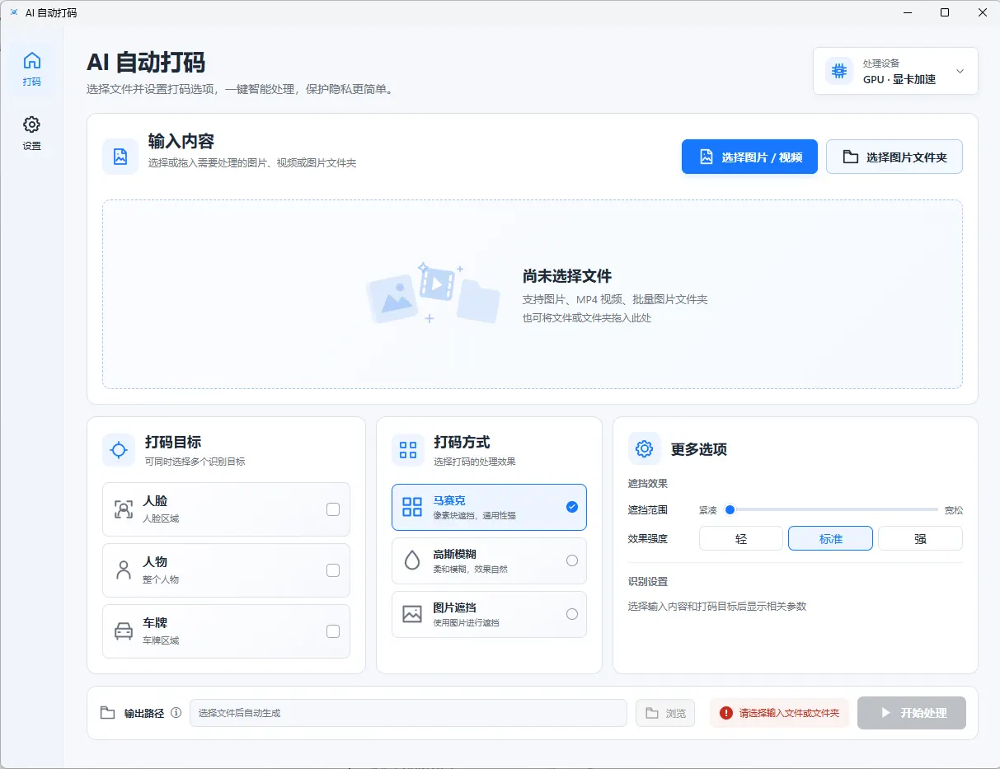

# AI 人脸打码

> 一款完全离线运行的 AI 人脸打码工具，支持图片和视频自动识别人脸并进行遮挡，所有处理均在本地完成，无需联网。

---

## ✨ 产品特点

### 🔒 全程本地处理

- 无需上传图片或视频
- 无需云端服务
- 支持离线使用
- 有效保护个人隐私

所有 AI 推理均在本机完成，文件不会离开你的电脑。

---

### 🤖 AI 自动识别人脸

自动检测图片或视频中的人脸，无需手动框选。

适用于：

- 视频分享
- 教学录制
- 自媒体创作
- 隐私保护
- 工作资料处理

---

### 🎭 多种打码方式

支持多种遮挡效果：

- 高斯模糊
- 马赛克
- 自定义图片覆盖

可根据实际需求选择不同效果。

---

### 🎬 图片 & 视频支持

支持：

- 图片批量处理
- 视频自动处理
- 自动导出处理结果

无需复杂设置，一键开始。

---

### ⚡ 快速处理

- CPU 即可运行
- 无需独立显卡
- 自动优化处理速度
- 支持长视频处理

---

## 使用流程

仅需三步：

1. 打开软件
2. 导入图片或视频
3. 点击开始处理

等待处理完成即可导出结果。

---

## 适用场景

- 短视频发布
- 自媒体内容创作
- 企业资料脱敏
- 教学视频
- 公共监控素材处理
- 隐私信息保护

---

## 系统要求

### 操作系统

- Windows 10
- Windows 11

### 推荐配置

- 64 位系统
- 4GB 以上内存
- Intel / AMD CPU

无需 GPU。

---

## 隐私说明

本软件坚持 **本地 AI** 的设计理念。

✔ 不上传图片

✔ 不上传视频

✔ 不采集人脸数据

✔ 不依赖云端接口

所有处理均在本地完成。

## 下载

请前往 **Releases** 下载最新版本：

👉 **https://github.com/ilyq/auto-masker/releases**
